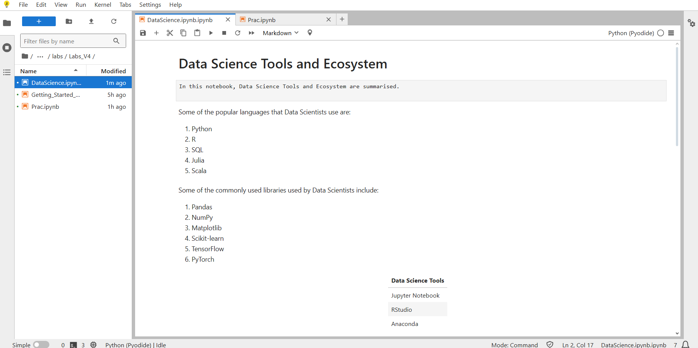
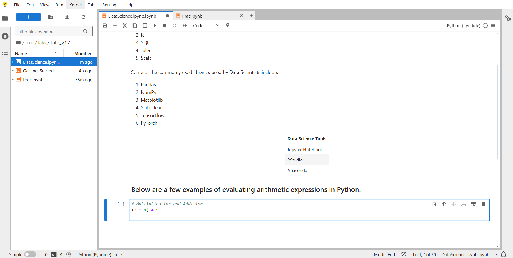
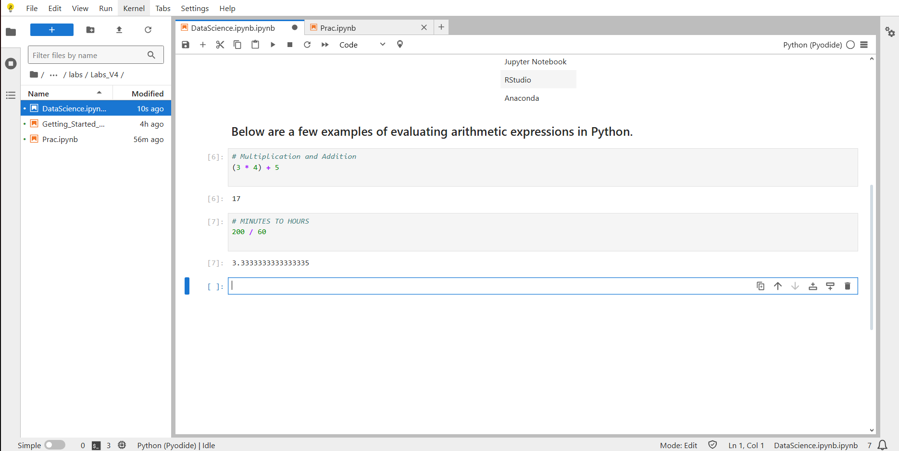
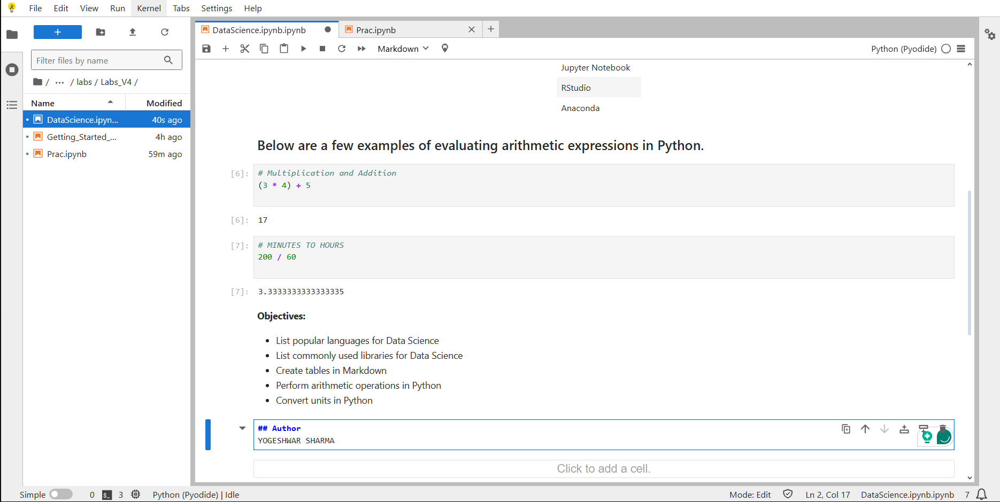

# Data Science Tools and Ecosystem

This repository contains the  assignment for the **_IBM Data Science_** course.  
The notebook demonstrates basic Markdown formatting, Python code execution, and GitHub integration.

##  Files in this repository
- `DataScienceEcosystem.ipynb` — Jupyter Notebook containing all exercises.
- `FIRST/` — Folder containing step-by-step screenshots of the notebook.

##  Screenshots
The screenshots follow the naming convention given in the assignment:
1. `NOTEBOOK.png` — First page of the notebook  

2. `TITLE.png` — Notebook title (H1) 

 
3. `INTRO.png` — Introduction cell  

4. `LANGUAGES.png` — Popular languages cell

  
5. `LIBRARY.png` — Libraries cell  

6. `TOOLS.png` — Data Science Tools table  

7. `ARITH.png` — Arithmetic examples intro  

8. `MULTIPLICATION AND ADDITION.png` — Multiply & add example  

9. `MINUTES TO HOURS.png` — Minutes to hours example  

10. `OBJECTIVES.png` — Objectives list  

11. `AUTHOR.png` — Author name  

##  How to view
1. Open the notebook directly in GitHub.
2. Or download and open in **Jupyter Notebook**.

##  Author
**Yogeshwar Sharma**
