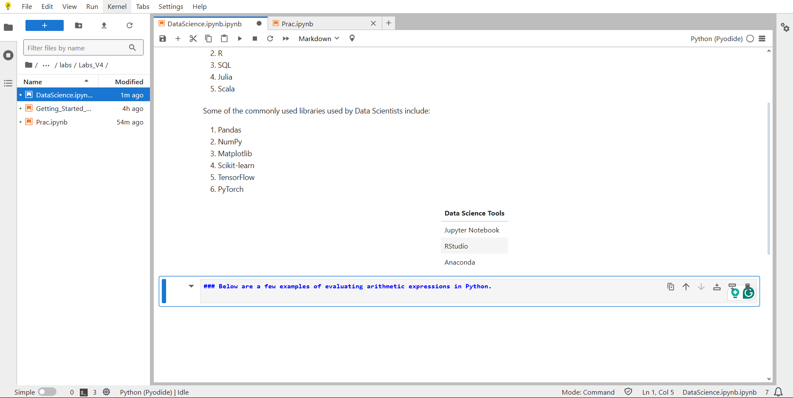

# Data Science Tools and Ecosystem

This repository contains the  assignment for the **IBM Data Science** course.  
The notebook demonstrates basic Markdown formatting, Python code execution, and GitHub integration.

## 📂 Files in this repository
- `DataScienceEcosystem.ipynb` — Jupyter Notebook containing all exercises.
- `FIRST/` — Folder containing step-by-step screenshots of the notebook.

## 📸 Screenshots
The screenshots follow the naming convention given in the assignment:
1. `TITLE.png` — Notebook title (H1)     

2. `INTRO.png` — Introduction cell  

3. `LANGUAGES.png` — Popular languages cell  

4. `LIBRARY.png` — Library cell  

5. `TOOLS.png` — Data Science Tools table

  
6. `ARITH.png` — Arithmetic examples intro

  
7. `OBJECTIVES.png` — Objectives list  

8. `END.png` — END

   

## 🚀 How to view
1. Open the notebook directly in GitHub.
2. Or download and open in **Jupyter Notebook**.

## 👤 Author
**Yogeshwar Sharma**
